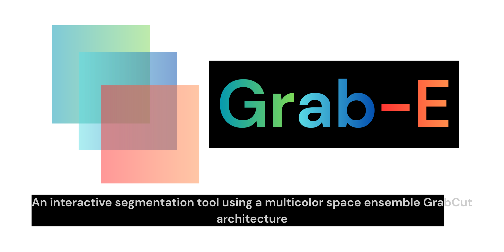

<p align="center">
  
</p>

<p align="center">
  <a href="https://www.python.org/">
    
  </a>
  <a href="https://doc.qt.io/qtforpython/">
    
  </a>
  <a href="https://opencv.org/">
    
  </a>
  <a href="https://pyinstaller.org/">
    
  </a>
</p>

## Overview

Grab-E is a desktop image segmentation application built around scribble-guided GrabCut refinement. It lets you mark foreground and background regions, runs segmentation in the GUI, and also supports batch processing from the command line.

The project combines:

- An interactive PySide6 desktop UI
- Multi-class scribble-based segmentation
- Multi-color-space ensemble processing
- Batch GrabCut tooling for offline runs
- PyInstaller packaging for a redistributable executable

## Features

- Load an image and draw segmentation scribbles directly in the app
- Refine masks iteratively without starting over
- Run segmentation across multiple color spaces for stronger results
- Export segmentation outputs for downstream use
- Process images in batch mode from the command line
- Build a standalone Windows executable with PyInstaller

## Project Branding

The repository includes app assets under `src/public/`, including:

- `src/public/splash-screen-logo.svg`
- `src/public/how_to_use_logo.svg`
- `src/public/github_logo.svg`
- `src/public/start_with_new_image_logo.svg`

These assets are used by the application UI and can also be reused when extending the documentation or product pages.

## Requirements

- Windows x64
- Python 3.13, or the same Python minor version used to build any included native extension
- Visual C++ Build Tools if you need to compile `mgc_core`

## Quick setup

1. Create and activate a virtual environment:

```powershell
python -m venv .venv
.\.venv\Scripts\Activate.ps1
```

2. Install Python dependencies:

```powershell
python -m pip install --upgrade pip
python -m pip install -r requirements.txt
```

## Native extension (`mgc_core`) guidance (Backend)

- If `mgc_core` already contains a matching compiled extension (for example a `*.pyd` built for Python 3.13/Win64), you do not need to build anything.
- If a compiled binary is not present or the target Python/OS differs, build the extension:

```powershell
cd mgc_core
python -m pip install --upgrade build setuptools wheel pybind11 Cython
python setup.py build_ext --inplace
```

You must have Visual C++ Build Tools installed for compilation on Windows.

## Model file (Backend)

Ensure the structured edge model is present:

```
mgc_core/third_party/sed/model.yml.gz
```

## Run the GUI

From the repository root:

```powershell
python src\main.py
```

## Batch Processing

The repository also includes a batch Grab-E CLI.

Batch processing is designed around the multi-color-space ensemble (majority-vote) workflow — this is the primary and recommended mode for offline runs. Include `--enable_majority_vote` to run the ensemble; without it the CLI will fall back to a single color-space GrabCut pass

Optional batch controls (detailed):

- `--num_images N`: Process at most `N` images from the annotations directory. Use `0` (the default) to process all available annotation files.
- `--start_one I`: 1-based index of the first annotation file to process. Useful to resume or slice a larger dataset (example: `--start_one 101` starts at the 101st file).
- `--color_space NAME`: Select the feature extraction color space for single-space mode. The CLI provides a range of color-space options (see `color_space.py`). This flag is ignored when `--enable_majority_vote` is present, since the ensemble runs multiple spaces in parallel.
- `--enable_majority_vote`: Enable the ensemble pipeline that runs three independent GrabCut branches (one per color space) and fuses the outputs by majority vote. This is the recommended/primary mode for batch processing.
- `--ensemble_trio A,B,C`: Comma-separated list of three color space names to use for majority voting (order matters for tie-preference). The default is `ruderman_lab,jzazbz,oklch` — the trio found to work best in experiments. The trio must contain exactly three entries.

Notes and defaults:

- The default ensemble trio (`ruderman_lab,jzazbz,oklch`) was selected after a brute-force search over all possible 3-color-space combinations drawn from a 12-space candidate pool (listed below). That combination produced the best overall consensus performance on our validation protocol.

- Candidate color-space pool used in the search:

  "rgb",
  "hsv_conic",
  "cielab",
  "c02_scd",
  "c16_scd",
  "oklab",
  "oklch",
  "jzazbz",
  "jzczhz",
  "ictcp_pq",
  "ycbcr_bt709",
  "ruderman_lab",

- Example ensemble run (default trio):

```powershell
python grabcut.py --images_dir PATH_TO_IMAGES --anns_dir PATH_TO_ANNOTATIONS --output_dir PATH_TO_OUTPUT --enable_majority_vote
```

Evaluation summary:

- Using the PASCAL VOC 2012 train_val subset and scribble annotations drawn from the s4Pascal scribbles dataset (2844 images), Grab-E's default ensemble achieves a mean Intersection-over-Union (mIoU) of 71.53% under the project evaluation protocol. This outperforms other classical baseline methods evaluated under the same settings.

## Build a Redistributable

To generate a packaged executable:

```powershell
python -m PyInstaller GrabE.spec
```

The build output is written to `dist/`.

## Repository Layout

```text
color_space.py        Color-space conversion utilities
grabcut.py            Batch GrabCut command-line entry point
GrabE.spec            PyInstaller build spec
io_utils.py           Image and annotation helpers
mgc_api.py            Multi-color-space GrabCut API surface
mgc_core/             Native core and structured edge support
scripts/              Automation scripts for experiments and builds
src/                  PySide6 GUI application
```

## Setup Notes

The file `setup.md` contains the fuller step-by-step setup and build guide. Use it if you need the native extension build path, dependency notes, or the exact packaging workflow.

## Attribution

Grab-E is a product from the partial fulfillment of the requirements for the degree of Bachelor of Science in Computer Science in the University of the Philippines Tacloban.

## License

This project is licensed under the MIT License — see the [LICENSE](LICENSE) file for details.
